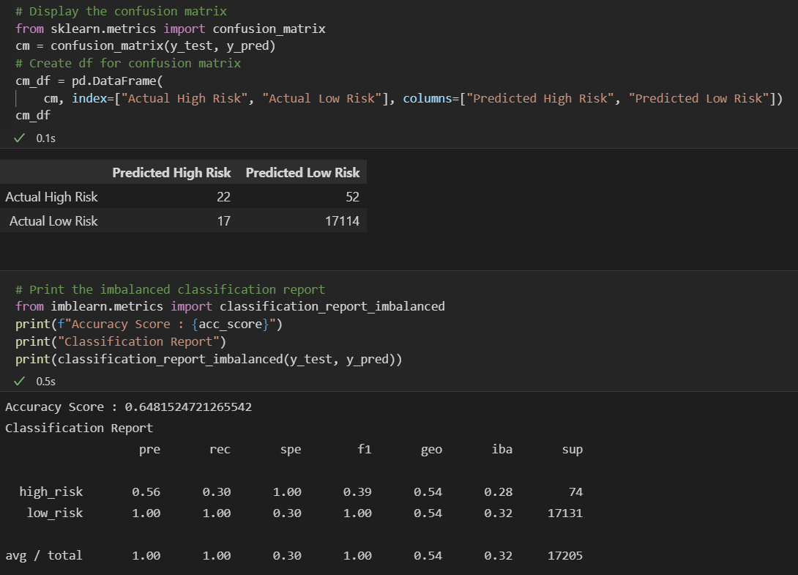

# Credit Risk Analysis

## Overview

The purpose of this analysis was to create a supervised machine learning model that could accurately predict credit risk. In order to complete this task, I used 6 different methods, which are:

1. Naive Random Oversampling.
2. SMOTE Oversampling.
3. Cluster Centroid Undersampling.
4. SMOTEENN Sampling.
5. Balanced Random Forest Classifying.
6. Easy Ensemble Classifying.

## Results

### Naive Random Oversampling

* Accuracy Score: 67.01%.
* Precision High Risk: 1%.
* Precision Low Risk: 100%.
* Recall High Risk: 68%.
* Recall Low Risk: 66%.

### SMOTE Oversampling

* Accuracy Score: 67.73%.
* Precision High Risk: 1%.
* Precision Low Risk: 100%.
* Recall High Risk: 72%.
* Recall Low Risk: 64%.

### Cluster Centroid Undersampling

* Accuracy Score: 52.0%.
* Precision High Risk: 0%.
* Precision Low Risk: 100%.
* Recall High Risk: 59%.
* Recall Low Risk: 44%.

### SMOTEENN Sampling

* Accuracy Score: 68.06%.
* Precision High Risk: 1%.
* Precision Low Risk: 100%.
* Recall High Risk: 76%.
* Recall Low Risk: 60%.

### Balanced Random Forest Classifying

* Accuracy Score: 64.81%.
* Precision High Risk: 56%.
* Precision Low Risk: 100%.
* Recall High Risk: 30%.
* Recall Low Risk: 100%.

### Easy Ensemble Classifying

* Accuracy Score: 92.29%.
* Precision High Risk: 6%.
* Precision Low Risk: 100%.
* Recall High Risk: 91%.
* Recall Low Risk: 94%.

## Summary

The results indicate that, in this case, the Easy Ensemble Classifier is the most effective model with a 92.29% balance accuracy score test (model's performance).

The average/total sensitivity is 94%. Sensitivity is more important than precision in order to detect fraudulent credit card risk results. False positives can be ruled out by contacting applicants directly to evaluate discrepancies. This model also shows that it is well balanced between sensitivity and precision, due to high yield F1 score (avg/total 97%).

For these reasons, I would recommend the use of this model in this case.